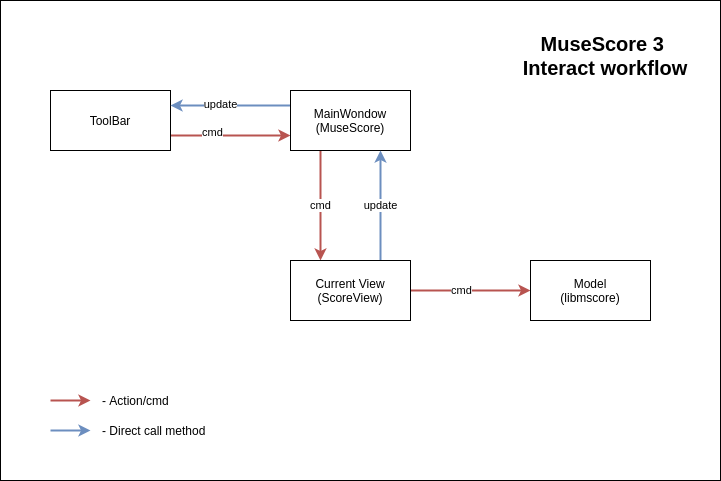
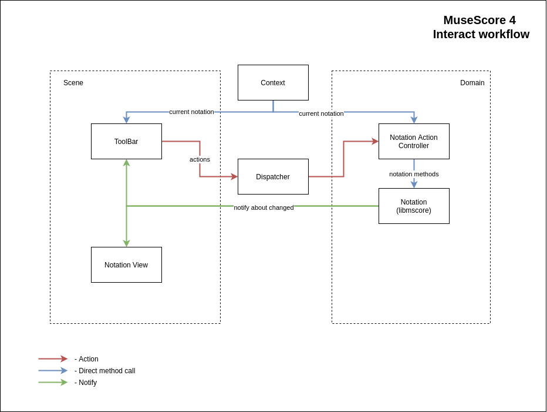

# Interact workflow

In MuseScore 3, most of the interactions between the user and the model are done through commands.
There is a list of `shortcuts`, `actions` are created from them (`QActions`), the action contains a command, when the action is triggered, the command pass to the main window (`MuseScore`), some commands are processed here, then pass to the current view (`ScoreView`), some commands are processed into the view, then pass to the model (`libmscore`), and there the rest of the teams are being processed.



In MuseScore 4, the main window ([AppShell](AppShell.md)) defines only the UI structure of the application and does not contain any action handlers.
Another feature, in MuseSCore 4 there may be a model object (notation/libmscore), but the notation (score) view may not be loaded, for example, if we are working in the sequencer mode now, so the notation (score) cannot process actions, or several handlers of the same action may appear in different places, which leads to complexity and code duplication.
For these reasons, in MuseScore 4, another workflow interaction



This architecture is very similar to [Flux architecture](https://facebook.github.io/flux/docs/in-depth-overview)

Example of sending and processing actions

Submit action

```cpp
void NotationToolBarModel::click(const QString& action)
{
    dispatcher()->dispatch(actions::namefromQString(action));
}
```

Register handlers

```cpp
NotationActionController::NotationActionController()
{
    dispatcher()->reg("domain/notation/note-input", this, &NotationActionController::toggleNoteInput);
    dispatcher()->reg("domain/notation/pad-note-4", [this]() { padNote(Pad::NOTE4); });
    ...
}

```

Handlers

```cpp
void NotationActionController::toggleNoteInput()
{
    auto notation = currentNotation();
    if (!notation) {
        return;
    }

    if (notation->inputState()->isNoteEnterMode()) {
        notation->endNoteEntry();
    } else {
        notation->startNoteEntry();
    }
}

void NotationActionController::padNote(const Pad& pad)
{
    auto notation = currentNotation();
    if (!notation) {
        return;
    }

    notation->padNote(pad);
}
```

Send notifications

```cpp
void Notation::startNoteEntry()
{
    ...
    m_inputStateChanged.notify();
}

void Notation::endNoteEntry()
{
    ...
    m_inputStateChanged.notify();
}

void Notation::padNote(const Pad& pad)
{
    ...
    m_inputStateChanged.notify();
}
```
